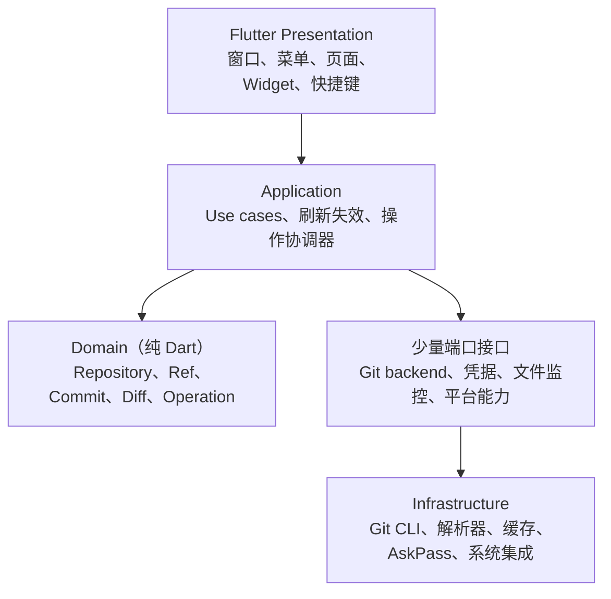

# Flutter Git 桌面客户端实施规划

- 版本：0.1
- 日期：2026-08-20
- 状态：P1 MVP 垂直闭环进行中
- 首发平台：macOS
- 后续平台：Windows、Linux

## 1. 产品定义

构建一个面向开发者和轻度 Git 用户的可视化桌面客户端：工作区状态清晰、
提交图直观、危险操作可预判、后台 Git 命令可追溯。

本项目对齐 Sourcetree 的公开功能和可见交互，但采用 Flutter 与系统 Git
独立实现，不追求其闭源内部结构、隐藏行为、私有接口或原版缺陷。

### “100%”的可验收定义

只有同时固定以下条件，才能把“100%复刻”转换成可测试目标：

1. 指定参考的 Sourcetree 版本和 macOS 版本。
2. 冻结功能支持矩阵、页面清单和交互状态清单。
3. 为每项功能建立成功、失败、取消、冲突和恢复用例。
4. 指定窗口尺寸、主题、文字缩放和截图基准。
5. 支持矩阵内的自动化与人工验收项目全部通过。

这一定义不包含源码、二进制、私有服务、品牌资源和未知隐藏行为的一致。

## 2. 优先级与边界

实施优先级固定为：

> 防止数据损坏 > Git 状态正确 > 操作可恢复 > 响应性能 >
> Graph / Diff / 暂存体验 > 视觉相似度 > 托管平台扩展

### 1.0 明确不做

- 不复制 Sourcetree 源码、Logo、商标、插画、文案或专有资源。
- 不自研 Git 对象库，不以 `libgit2` 作为首版执行引擎。
- 不支持 Mercurial、Git-SVN 和 Perforce。
- 不建设代码编辑器、完整终端、Git 托管服务或 Issue/PR 管理平台。
- 不依赖 Atlassian 私有接口。
- 不默认执行 `reset --hard`、`clean`、强制推送等高风险动作。
- 不承诺所有企业 SSO、私有协议和未知 Git 服务兼容。
- Windows、Linux 不进入 macOS 1.0 的发布门槛。

## 3. 功能范围

| 模块 | MVP | Alpha / Beta | 1.x |
| --- | --- | --- | --- |
| 仓库管理 | 打开、克隆、初始化、窗口内多仓库标签页、会话恢复 | 收藏 | 工作区分组 |
| 工作区 | tracked/untracked/ignored 状态、整文件暂存 | hunk/行级暂存、过滤、丢弃预览 | sparse checkout 增强 |
| Diff | Unified Diff、文本/二进制识别、大文件降级 | 左右对比、语法高亮、空白选项 | 可扩展渲染器 |
| 提交 | Commit、作者校验、hook 错误展示 | Amend、模板、签名状态 | 提交草稿 |
| 历史 | 分页列表、基础 DAG、提交详情 | 搜索、文件历史、Blame、Reflog | 高级查询 |
| Branch / Tag | 创建、切换、删除本地分支 | 重命名、跟踪关系、Tag | Worktree |
| 远端 | Fetch、Pull、Push、进度和取消 | Remote 管理、Prune、安全 Force Push | 托管平台适配 |
| 高级操作 | — | Merge、Rebase、Cherry-pick、Revert、Reset、Stash | 高级批量操作 |
| 冲突 | 检测并展示进行中状态 | ours/theirs、Continue/Skip/Abort、外部工具 | 内置三方合并器评估 |
| Git 扩展 | — | Submodule、LFS 基础能力 | 深度增强 |
| 桌面集成 | Finder/终端入口、快捷键、深浅主题 | 中英文、外部 Diff/Merge、自动更新 | Windows/Linux 原生集成 |

## 4. 首版信息架构

桌面端采用高信息密度的三栏布局，提交图是产品的主要识别元素。布局必须支持
窗口缩放、键盘操作和分栏宽度记忆，不使用固定屏幕尺寸。

```text
┌──────────────────────────────────────────────────────────────────┐
│ 仓库 / 当前分支       Fetch  Pull  Push  Branch  Commit  搜索    │
├──────────────┬────────────────────────────┬──────────────────────┤
│ 工作区       │ 提交 Graph + 历史列表      │ 提交 / 文件详情      │
│ Branches     │                            │                      │
│ Remotes      ├────────────────────────────┴──────────────────────┤
│ Tags         │ Changes / Diff / 暂存区                           │
│ Stashes      │                                                   │
├──────────────┴───────────────────────────────────────────────────┤
│ 操作状态、ahead/behind、后台任务、可展开命令日志                  │
└──────────────────────────────────────────────────────────────────┘
```

必须设计并测试的通用状态：

- 首次使用、无仓库、空仓库和 unborn branch。
- 加载、局部刷新、离线、认证等待、错误和已取消。
- detached HEAD、浅克隆、bare repo、submodule 和 linked worktree。
- merge/rebase/cherry-pick/revert 进行中与冲突暂停。
- 超长分支名、Unicode/换行文件名、大量改动、二进制和超大文件。
- 深色/浅色、高对比、200% 文字缩放、减少动态效果。

## 5. 技术架构

采用按功能组织的轻量分层，UI 不直接执行或解析 Git 命令。



建议功能模块：

- `app_shell`：窗口、菜单、布局恢复、主题和路由。
- `workspace`：最近仓库、打开、克隆、初始化和收藏。
- `repository`：仓库识别、worktree/common-dir 和状态快照。
- `changes`：工作区/index 状态、stage/unstage 和安全丢弃。
- `diff`：文件元数据、hunk、blob、语法高亮和大文件降级。
- `history`：分页历史、搜索、提交详情和 Git Graph。
- `refs`：branch、tag、remote 和 tracking。
- `operations`：commit、merge、rebase、reset、revert、stash 等操作队列。
- `remote_auth`：fetch/pull/push、进度、AskPass 和凭据代理。
- `conflicts`：冲突状态、解决动作和 continue/abort。
- `settings_integrations`：Git 路径、代理、终端和外部工具。
- `platform`：macOS/Windows/Linux 的窗口、进程、凭据库和文件定位。

仓库身份使用：

```text
RepositoryId = canonical common-dir + canonical worktree root
```

不能只用目录路径，否则无法正确区分 linked worktree、bare repo、submodule
和普通仓库。

### 初始技术选择

- UI：Flutter stable。
- 状态与依赖注入：首选 `flutter_riverpod`，不混用多套状态框架。
- Git 引擎：系统或用户指定的 Git CLI。
- 本地数据：早期只保存最近仓库和布局；确需缓存时再引入 SQLite。
- 文件选择：优先使用官方 `file_selector`。
- 路径：`path`、`path_provider`。
- 语法高亮、Keychain、自动更新等依赖在对应原型验证后再引入。

第一版不引入 `libgit2`。Git CLI 对现有配置、hooks、LFS、submodule、
SSH、credential helper 和仓库格式兼容更好。后续只允许在经过基准测试的
纯读取热点通过同一端口替换实现。

## 6. Git 执行契约

统一实现 `GitRunner`，Controller 和 Widget 不得拼接 Git 命令：

```text
GitInvocation
  executable
  workingDirectory
  arguments[]
  environmentPolicy
  stdin
  outputLimit
  cancellationToken
  commandPolicy

GitResult / GitEvent
  exitCode
  stdoutBytes
  stderrBytes
  duration
  progress
  classifiedError
```

强制规则：

- 使用 `Process.start(executable, arguments, runInShell: false)`，禁止交给 shell。
- 文件参数置于 `--` 后，并使用 literal pathspec 防止参数注入。
- 机器读取统一禁用 pager、颜色和交互输出。
- 优先解析 porcelain/plumbing 接口和 NUL 分隔的原始 bytes。
- 不解析本地化的人类提示，不假定 OID 固定为 40 位。
- 每次写操作结束后重新读取仓库，即使命令返回非零。
- merge/rebase 的冲突是“暂停状态”，不能当作无状态变化的普通失败。
- 遇到未知 `index.lock` 不自动删除。
- 不自动修改用户的 global/system Git 配置或 `safe.directory`。

优先使用的稳定接口：

- 仓库识别：`git rev-parse`。
- 状态：`git status --porcelain=v2 -z --branch`。
- refs：`git for-each-ref`，字段使用 NUL 分隔。
- 历史拓扑：`git rev-list --parents --topo-order`。
- 对象批量读取：长驻 `git cat-file --batch`。
- Diff 元数据：`git diff --raw -z`、`--numstat -z`。
- Patch：`git diff --no-color --no-ext-diff`。
- Blame：`git blame --line-porcelain`。

Git Graph 从 OID、parents 和 topo order 独立计算 lane，不解析
`git log --graph` 的 ASCII 图。分页固定 ref tip 快照；refs 改变后创建
新的 generation，避免分页前后拓扑漂移。

## 7. 并发、刷新与恢复

- 每个仓库一个调度器：写操作独占，普通读取限制并发。
- 全应用限制 Git 子进程数量。
- status、search、diff 使用 latest-wins，并终止过期进程。
- UI 保留 stale data 并标注刷新，不在刷新时清空整个页面。
- 写操作返回精确的失效范围，例如 `status/refs/history/diff`。
- 请求携带 repository generation，仓库切换后旧结果不得回写。
- 应用操作完成后立即刷新；文件监控做 debounce/coalesce。
- 窗口重新获得焦点时兜底刷新。
- 启动及操作后检测 merge/rebase/cherry-pick/revert/sequencer 状态。

操作状态机统一为：

```text
准备 → 运行 → 等待认证 / 冲突暂停 → 成功 / 失败 / 已取消 → 重新探测仓库
```

取消 Clone、Pull、Commit、Push 等操作时不能假定“没有发生任何事”：
必须比较操作前后的目录、HEAD、refs 和远端状态，再向用户报告结果。

## 8. 凭据与仓库安全

- 默认复用 Git credential helper、SSH Agent 和 macOS Keychain。
- token、密码和私钥不得进入命令参数、remote URL、普通日志或崩溃报告。
- 后台刷新使用 `GIT_TERMINAL_PROMPT=0`，避免隐藏进程等待输入。
- 一次性 AskPass IPC 的安全评估已记录在 [ASKPASS_IPC_EVALUATION.md](ASKPASS_IPC_EVALUATION.md)；
  仅 macOS 正式 app bundle 的用户主动 Clone、Fetch、Pull、Push 会启用受限管道与受控凭据输入；
  后台 Git 调用不注入 AskPass。
- 不导入或复制 SSH 私钥，不静默接受 host key 变化。
- 日志集中脱敏带认证信息的 URL、Header、路径和 prompt 回答。
- 仓库内容、提交信息、分支名和文件名全部视为不可信输入。
- 默认禁用 external diff/textconv；启用前明确提示其可执行外部程序。
- hooks、filters、credential helper 和 `core.sshCommand` 纳入仓库信任模型。
- 破坏性操作必须显示准确 ref/OID/文件范围，采用安全默认值和强确认。
- Force Push 默认只提供 `--force-with-lease`。

macOS 首发建议采用 Developer ID 签名并公证的站外 DMG。Mac App Store
沙盒与任意仓库访问、Git/SSH 子进程及终端集成存在明显冲突，单独评估。

## 9. 分阶段路线图

### P0：技术原型

目标是先消除最可能造成返工或数据风险的问题，不制作完整 UI。

1. Flutter macOS 工程、窗口壳和基础主题。
2. Git 路径/版本探测与仓库识别。
3. 无 shell 的 `GitRunner`、取消和脱敏日志。
4. `porcelain v2 -z` 状态解析及怪异文件名 fixture。
5. 历史分页与 Git Graph lane 算法原型。
6. Diff 元数据/patch 分离和大文件降级。
7. 临时仓库测试工厂与本地 bare remote。
8. macOS 进程树取消、Finder 权限和签名/公证可行性验证。

退出条件：能安全打开测试仓库，准确展示 status、首屏历史和基础 Diff；
解析器覆盖 Unicode、换行文件名、rename、binary、conflict、worktree、
detached HEAD、SHA-1/SHA-256 等边界。

### P1：MVP 垂直闭环

当前进度（2026-08-20）：进行中。

已完成并由真实 Git fixture 覆盖：

- 单仓库打开、空目录初始化和克隆到空目录。
- 窗口内多仓库 tab：每个成功打开或克隆的 worktree 保留独立 tab；点击时重新读取该仓库，
  同名目录以父目录消歧且切换后标题稳定；读取失败会保留原激活项。远端操作运行期间禁止
  切换，避免把写入操作误归属到其他仓库。
- 会话恢复：本机应用支持目录仅保存已打开 worktree 的路径和最后激活项；启动时顺序恢复，
  自动丢弃失效路径，不保存凭据、Git 操作记录或仓库内容。
- 工作区状态、整文件 stage/unstage、Unified Diff、基础历史 DAG 和提交详情；提交图采用
  96px 宽的连续深灰图栏、实心节点与直角分叉连线，主线和分支以蓝/橙等高对比色区分；历史
  读取覆盖所有本地分支，以呈现真实分叉与合并拓扑。
- 安全 Commit（stdin 传递信息且不跳过 hooks）。
- 创建本地分支、分支列表，以及仅在干净工作区的安全分支切换。
- Fetch `origin`（不修改工作区，支持取消）。
- Pull `--ff-only`（仅 clean worktree/index、配置 upstream 时启用，支持取消；拒绝隐式 merge commit）。
- 安全 Push 当前分支 upstream（仅允许存在 ahead 提交时执行，显式锁定远端/refspec，不受用户 `push.default` 影响；显示目标与数量，支持取消，禁止 force push）。
- Push 取消或异常退出后，使用可取消的只读 `ls-remote` 核验远端是否已包含本地 HEAD；核验不会修改本地 tracking refs，并提示用户 Fetch 刷新 ahead/behind。
- 统一操作进度与日志：Clone、Fetch、Pull、Push 均记录运行/成功/取消/失败状态，状态栏显示不确定进度并可打开最近 12 条的脱敏操作记录。
- 核心旅程真实 Git 冒烟：覆盖“克隆 → 修改 → 暂存 → 提交 → 创建分支 → 推送”及远端 ref、ahead/behind、操作记录断言。
- macOS 核心工作区 UI E2E：`integration_test` 在真实 Flutter desktop app 与本地 bare remote
  fixture 中覆盖打开工作区、暂存、提交、创建分支、推送、ahead/behind 与远端 ref 核验。
- macOS AskPass UI E2E：正式 bundle 的 native helper、broker、session 和 Flutter 脱敏弹窗
  完成一次取消链路验证；真实认证远端的恢复与结果核验仍待受控账户环境。
- AskPass IPC 安全设计评估：保持无交互认证默认值，冻结单次 helper、nonce、权限、取消和脱敏契约，并以 macOS helper/broker 实施。
- AskPass 应用侧协议校验：拒绝非法 nonce、未知字段和超限 prompt，且协议对象不保存秘密。
- AskPass macOS helper：固定路径的 socket 转发 helper 已编译并打包进 Debug app；正式 bundle
  的用户主动远端操作通过单次 broker/session 启用 `GIT_ASKPASS`。
- AskPass Flutter 一次性 socket session：随机 `0700` 临时目录中的 `0600` Unix socket、
  每次 256-bit nonce、单连接、16 KiB 响应限制、取消/拒绝/超时清理均已由单元测试覆盖；
  会话环境只能从 `Platform.resolvedExecutable` 的固定 app bundle 路径推导 helper；
  测试 fixture 路径入口受 `@visibleForTesting` 标识；
  同一份 C helper 已通过与 Flutter session 的进程级 socket 往返测试；helper 会验证
  socket owner/权限及 server peer UID；native IPC broker 已打包并可验证 helper peer UID，
  正式 macOS app bundle 的 Flutter session 已切换至该 broker；
  nonce 重放、第二连接、畸形 UTF-8 与错误 nonce helper 均已有负向测试；认证 UI 通过
  单次提示协调器接入 macOS 正式 app bundle 的用户主动 Clone、Fetch、Pull、Push，取消会
  同时关闭弹窗与 session/broker；后台刷新、状态、Diff 和 Push 后核验不注入 AskPass。
  开发/测试 runtime 不猜测 helper 路径或设置 `GIT_ASKPASS`，保留既有 credential helper /
  SSH Agent 的无交互兼容；源码泄漏扫描和 URL/Header/query 脱敏测试、credential helper 调用
  顺序与 SSH Agent socket 环境契约测试已完成；真实私有远端、Release 签名和 Keychain/企业
  SSO 兼容性验证待完成。

待完成：真实认证远端、Release 签名与凭据兼容性验证，以及 macOS 认证等待/取消/恢复 UI E2E。

退出条件：用户无需终端完成
“克隆 → 修改 → 暂存 → 提交 → 创建分支 → 推送”；状态与 Git CLI 一致，
Git 进程不阻塞 UI，危险操作不静默执行。

### P2：Alpha

- 多仓库标签页。
- hunk/行级暂存、Amend。
- Tag、Stash、Merge、Rebase、Cherry-pick、Revert、Reset。
- 历史搜索、左右 Diff、基础冲突处理。
- Remote 管理、Keychain、快捷键和主题。

退出条件：真实 Git 集成测试覆盖核心成功、失败、取消、冲突和恢复流程；
应用重启后能识别正在进行的操作，区块暂存后的 index 内容可精确验证。

### P3：Beta

- Blame、文件历史、Reflog、交互式 Rebase。
- Submodule/LFS 基础能力。
- 安全 Force Push、后台 Fetch、外部 Diff/Merge 工具。
- 会话恢复、中英文、无障碍。
- 自动更新、诊断包、正式签名和公证。

退出条件：声明支持的 macOS/CPU 矩阵通过关键 E2E；无已知 P0/P1
数据损坏问题；键盘可完成核心旅程，VoiceOver 标签完整，性能达到预算。

### P4：macOS 1.0

- 修复 Beta 缺陷，冻结功能矩阵。
- 统一交互和视觉，完成 onboarding、帮助、隐私与恢复指引。
- 验证干净机器安装、升级、回退和 Gatekeeper。
- 完成依赖许可证、SBOM 和高危漏洞处置。

退出条件：支持矩阵中的关键 E2E 100% 通过；破坏性操作均有预览、确认和
恢复指引；正式安装包完成签名、公证与干净机器验证。

### P5：跨平台

核心端口稳定后再进入 Windows/Linux，分别处理路径、进程树、凭据管理、
CRLF、长路径、大小写、symlink、可执行位、窗口和系统菜单差异。

## 10. 测试与验收

### 测试金字塔

| 层级 | 建议占比 | 主要覆盖 |
| --- | ---: | --- |
| Dart 单元/属性测试 | 55–60% | parser、argv、Graph lane、状态机、路径和日志脱敏 |
| 真实 Git 集成测试 | 25–30% | 临时仓库的 index、refs、远端、冲突、取消和恢复 |
| Widget/Golden | 10–15% | Diff、Graph、状态页面、主题、缩放和 Semantics |
| macOS E2E | 约 5% | 从打开/克隆到 Commit/Pull/Push 的关键旅程和签名包冒烟 |

测试只能操作独立临时仓库，并隔离 HOME、Git config、credential helper
和 hooks。默认使用本地 bare repo 模拟 origin，不依赖公网。

固定 fixture 至少包括：

- 空仓库、线性/分叉/合并/八爪历史、多个 refs。
- staged/unstaged/untracked/ignored/rename/copy/delete/binary。
- 空格、Tab、换行、Emoji、中文、Unicode NFC/NFD 和超长路径。
- 各类文本、二进制、rename/delete、modify/delete 冲突。
- ahead/behind/diverged/non-fast-forward 和远端分支删除。
- 中断的 merge/rebase/cherry-pick/revert。
- detached HEAD、shallow、worktree、submodule、LFS 和 sparse checkout。
- index.lock、只读目录、损坏对象、远端不可达和认证失败。

所有核心旅程必须覆盖成功、失败、取消、冲突和应用重启恢复；所有关键操作
必须可通过键盘完成。Graph 和 Diff 不只依赖红绿颜色表达状态。

## 11. 初始性能预算

以下数字是首轮原型的目标，不是未经测量的完成声明。固定 Apple Silicon
参考机、Release 构建和数据集后记录 cold/warm median 与 P95。

- 冷启动可交互 P95 ≤ 3 秒，热启动 ≤ 1.5 秒。
- 大仓库首屏 500 条历史 P95 ≤ 2.5 秒。
- 大仓库状态刷新总计 ≤ 5 秒，应用自身额外开销 ≤ 500ms。
- 主线程不得连续阻塞 100ms，滚动 P95 frame time ≤ 24ms。
- 普通仓库空闲内存 ≤ 350MB，大仓库 ≤ 800MB。
- 空闲 CPU ≤ 2%。
- 相对上一稳定版回退超过 15% 时阻断发布，除非记录豁免原因。

基准大仓库建议为：10 万文件、10 万提交、1000 refs、1 万个工作区变更。
历史、文件列表和 Diff 必须分页或虚拟化，Graph/patch 解析必须可取消并在
必要时移入 isolate。

## 12. 主要风险

| 风险 | 影响 | 首要控制 |
| --- | --- | --- |
| reset/clean/force 导致数据丢失 | 极高 | 首版延后，精确预览、强确认、安全默认 |
| hooks/helper/textconv 执行恶意程序 | 极高 | 仓库信任模型、安全模式、显式开启 |
| token 泄漏到参数或日志 | 极高 | Keychain、AskPass、集中脱敏和泄漏测试 |
| Push 取消后结果不确定 | 高 | 查询远端核验，禁止盲目重试 |
| Graph 复杂拓扑错误 | 高 | 合成仓库、属性测试、tip snapshot |
| Git 版本与平台差异 | 高 | 稳定机器格式和支持版本矩阵 |
| 大仓库卡顿或内存增长 | 高 | 分页、虚拟化、取消和持续基准 |
| 文件监听遗漏/刷新风暴 | 中高 | 事件合并、焦点刷新和周期校准 |
| macOS 沙盒限制 | 高 | 先做 Developer ID 站外发布原型 |
| 过度模仿引发知识产权风险 | 高 | 独立名称、品牌、素材和实现 |

## 13. 待确认但不阻塞 P0 的决策

1. 用哪个 Sourcetree 版本作为可见行为和截图参考。
2. 正式产品名、图标和独立视觉方向。
3. macOS 最低支持版本，是否发布 Intel 构建。
4. 首发是否只用系统 Git，是否允许选择 Homebrew/自定义 Git。
5. 1.0 是否包含 GitHub/GitLab/Bitbucket OAuth 与托管平台 API。
6. 发行方式：Developer ID 站外 DMG，还是另行投入 Mac App Store 适配。
7. 是否采集完全匿名、默认关闭的崩溃和性能遥测。

## 14. 下一步

1. 验证 Release/Developer ID 签名、Gatekeeper、真实认证远端和 credential helper / SSH Agent /
   Keychain 兼容性，完成凭据泄漏扫描。
2. 扩展 macOS UI E2E，覆盖原生目录选择/Clone 与认证等待、取消、恢复和远端结果核验。
