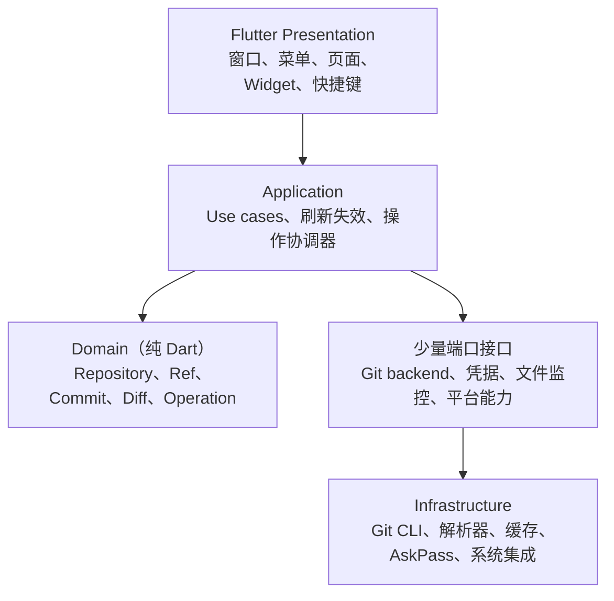

# Flutter Git 桌面客户端实施规划

- 版本：0.2
- 日期：2026-08-24
- 状态：P1 MVP 垂直闭环进行中
- 首发平台：macOS
- 后续平台：Windows、Linux

## 1. 产品定义

构建一个面向开发者和轻度 Git 用户的可视化桌面客户端：工作区状态清晰、
提交图直观、危险操作可预判、后台 Git 命令可追溯。

本项目对齐 Sourcetree 的公开功能和可见交互，但采用 Flutter 与系统 Git
独立实现，不追求其闭源内部结构、隐藏行为、私有接口或原版缺陷。

### “100%”的可验收定义

只有同时固定以下条件，才能把“100%复刻”转换成可测试目标：

1. 指定参考的 Sourcetree 版本和 macOS 版本。
2. 冻结功能支持矩阵、页面清单和交互状态清单。
3. 为每项功能建立成功、失败、取消、冲突和恢复用例。
4. 指定窗口尺寸、主题、文字缩放和截图基准。
5. 支持矩阵内的自动化与人工验收项目全部通过。

这一定义不包含源码、二进制、私有服务、品牌资源和未知隐藏行为的一致。

## 2. 优先级与边界

实施优先级固定为：

> 防止数据损坏 > Git 状态正确 > 操作可恢复 > 响应性能 >
> Graph / Diff / 暂存体验 > 视觉相似度 > 托管平台扩展

### 1.0 明确不做

- 不复制 Sourcetree 源码、Logo、商标、插画、文案或专有资源。
- 不自研 Git 对象库，不以 `libgit2` 作为首版执行引擎。
- 不支持 Mercurial、Git-SVN 和 Perforce。
- 不建设代码编辑器、完整终端、Git 托管服务或 Issue/PR 管理平台。
- 不依赖 Atlassian 私有接口。
- 不默认执行 `reset --hard`、`clean`、强制推送等高风险动作。
- 不承诺所有企业 SSO、私有协议和未知 Git 服务兼容。
- Windows、Linux 不进入 macOS 1.0 的发布门槛。

## 3. 功能范围

| 模块 | MVP | Alpha / Beta | 1.x |
| --- | --- | --- | --- |
| 仓库管理 | 独立仓库首页、打开、克隆、初始化、Finder 目录拖入添加、组内拖动排序、根目录 `icon.png` 图标、当前分支与改动数摘要、单仓库工作区窗口、仓库清单恢复 | 收藏 | 工作区分组 |
| 工作区 | tracked/untracked/ignored 状态、整文件暂存、分组批量暂存/取消暂存；暂存切换和已暂存文件重置期间保留现有列表与历史，以标题进度表达写入且保持复选框原选中颜色，只在 Git 完成后原子替换工作区状态，仍有改动时保持 `Uncommitted changes`，工作区变干净时选择最新提交；从 `Uncommitted changes` 或“文件状态”手动刷新时保留入口及有效文件选择并清除失效选择；暂存和未暂存列表均可经确认删除所选工作区文件且不直接修改索引；普通已跟踪文本文件的未暂存 Diff 区块支持单独暂存或确认后放弃，已暂存区块支持单独取消暂存，刷新后恢复入口和仍有效的文件选择；同时改变已有文件模式（含 executable bit）的 Diff 不提供区块操作；左侧“工作区”提供“文件状态”和“历史”入口，前者完整展示工作区文件、Diff 和提交入口，后者的 `Uncommitted changes` 在提交图内选中并显示下方改动面板 | 行级暂存、过滤、丢弃预览 | sparse checkout 增强 |
| Diff | Unified Diff、文本/二进制识别、大文件降级 | 左右对比、语法高亮、空白选项 | 可扩展渲染器 |
| 提交 | Commit、Amend、作者校验、hook 错误展示 | 模板、签名状态 | 提交草稿 |
| 历史 | 分页列表、基础 DAG、提交详情、双击或右键检出提交、将选定提交合并到当前分支、从选定提交创建分支、标签、复制 SHA-1、推送、变基、重置、回滚、创建补丁和遴选；历史提交中的文本新增、修改和删除 Diff 支持确认后按区块反向应用到当前工作区，不改写原提交，同时改变已有文件模式（含 executable bit）时不提供区块回滚；历史提交文件列表的“查看选中的修改日志…”会以路径过滤已加载本地分支历史、跟踪单文件重命名，并按各提交的实际路径在独立只读视图显示真实摘要和 Unified Diff；关闭或切换会取消过期读取，非 UTF-8 路径入口保持禁用并标注“（待实现）”；审查、重置到提交、打开版本、Finder、复制路径、快速查看、外部 Diff 和自定义操作仍直接标注“（待实现）”，其中“重置到提交…（待实现）”暂禁用，其余文件动作暂为无副作用提示；变基/回滚/遴选要求干净工作区，hard reset 必须额外确认；非提交对象标签保留在导航但不进入提交详情 | 搜索、Blame、Reflog | 高级查询 |
| Branch / Tag | 创建/切换/重命名本地分支、从指定本地或已获取远端分支创建分支、引用右键菜单、安全删除已合并分支；读取本地 Tag、从历史提交创建轻量/附注 Tag、精确推送或确认删除本地/指定远端 Tag | Tag 签名与远端 Tag 状态管理 | Worktree |
| 远端 | 按已配置远端分组展示跟踪引用和符号 HEAD、按远端配置 Pull/Fetch/Push、右键安全移除本地远端配置、进度和取消 | Prune、安全 Force Push | 托管平台适配 |
| 高级操作 | 本地分支安全合并、拉取变基、从历史提交变基及可编辑交互式 todo（当前支持 pick、edit、squash、fixup、drop；内置提交信息编辑器完成前不暴露 reword）、变基/遴选/回滚 Continue/Abort、Cherry-pick、Revert、Reset、从原生“动作”菜单创建/检查/应用补丁和停止追踪；创建补丁复用历史页的提交 Graph、引用、文件、Diff 与详情视图，支持多选并合并或独立导出；应用补丁明确区分默认 Git `-p1` 与显式 strip 值；原生“动作”菜单的停止追踪按当前 key workspace 的 Flutter 选择快照动态启用，适用于普通已追踪改动、已暂存新增文件和历史提交文件；历史文件优先作为路径来源并在确认框显示，应用层会重读当前索引和本地文件状态后才执行；同一路径混合暂存/未暂存修改时仍只移除索引项并保留本地最新文件；其余动作入口保留并将未实现项标注待实现且不执行写操作；菜单只路由当前前台工作区，补丁窗口支持四边/四角缩放并保持在可见边界；原生“仓库”菜单可显示当前仓库的 Git 详情（提交、引用、文件、作者、LFS 和本地占用），其余入口明确标注待实现且不执行写操作；冲突状态展示、贮藏创建/恢复/弹出/删除（工具栏和左侧入口创建；左侧固定显示真实贮藏列表，选择后在引用导航右侧完整预览文件和 Diff；仅在可安全保存已跟踪改动时启用） | 高级批量操作 | 高级查询 |
| 冲突 | 检测并展示进行中状态；内置文本 Diff 左右对比、选边、编辑结果并标记已解决；变基可 Continue/Abort | Skip、外部工具 | 二进制和高级三方合并器评估 |
| Git 扩展 | — | Submodule、LFS 基础能力 | 深度增强 |
| 桌面集成 | Finder/终端入口、快捷键、深浅主题、原生仓库/动作/窗口菜单（窗口菜单保留最小化、缩放、仓库浏览器、合并和系统窗口列表；平铺、显示器、窗口组及标签页项待实现） | 中英文、外部 Diff/Merge、自动更新 | Windows/Linux 原生集成 |

## 4. 首版信息架构

桌面端采用高信息密度的三栏布局，提交图是产品的主要识别元素。布局必须支持
窗口缩放、键盘操作和分栏宽度记忆，不使用固定屏幕尺寸。当前 MVP 的历史记录采用 Sourcetree
式紧凑历史行：保留图表、描述、提交、作者、日期表头，24px 行高、无行间分割线、主题自适应背景与连续提交图；打开含历史的仓库时默认选中最新提交，显示其详情及首个可预览文件的差异；日期表头及内容左对齐；未变化的活动路径保持垂直，仅在分叉插入或路径结束时让右侧车道以短斜线同步补位，避免无条件逐行重排及长期空洞；图栏最多绘制 8 条物理车道，第九条及更右侧逻辑路径折叠进第八条溢出车道，节点不会因裁切消失；当前 HEAD 谱系固定占用主蓝色车道，复杂游离 HEAD 也保留完整汇合节点和连线，节点、连线、提交标签和左侧图标复用实际车道颜色；搜索只过滤渲染行，不改变完整拓扑；Graph/描述/提交/作者/日期列可从
历史内容的可访问拖拽边界调整。Changes 文件列表宽度，以及已暂存与未暂存文件区域的高度同样
可调整；所有分隔条均设有安全的最小尺寸，窗口变窄时自动收缩。

```text
┌──────────────────────────────────────────────────────────────────┐
│ 仓库 / 当前分支       Fetch  Pull  Push  Branch  Commit  搜索    │
├──────────────┬────────────────────────────┬──────────────────────┤
│ 工作区       │ 提交 Graph + 历史列表      │ 提交 / 文件详情      │
│ 文件状态     │ Uncommitted changes → 改动 │                      │
│ 历史         │                            │                      │
│ Branches     │                            │                      │
│ Remotes      ├────────────────────────────┴──────────────────────┤
│ Tags         │ Changes / Diff / 暂存区                           │
│ Stashes      │                                                   │
├──────────────┴───────────────────────────────────────────────────┤
│ 操作状态、ahead/behind、后台任务、可展开命令日志                  │
└──────────────────────────────────────────────────────────────────┘
```

必须设计并测试的通用状态：

- 首次使用、无仓库、空仓库和 unborn branch。
- 加载、局部刷新、离线、认证等待、错误和已取消。
- detached HEAD、浅克隆、bare repo、submodule 和 linked worktree。
- merge/rebase/cherry-pick/revert 进行中与冲突暂停。
- 超长分支名、Unicode/换行文件名、大量改动、二进制和超大文件。
- 深色/浅色、高对比、200% 文字缩放、减少动态效果。

## 5. 技术架构

采用按功能组织的轻量分层，UI 不直接执行或解析 Git 命令。



建议功能模块：

- `app_shell`：仓库首页、单仓库窗口、窗口去重、菜单、布局恢复、共享主题和路由。
- `workspace`：最近仓库、打开、克隆、初始化和收藏。
- `repository`：仓库识别、worktree/common-dir 和状态快照。
- `changes`：工作区/index 状态、stage/unstage 和安全丢弃。
- `diff`：文件元数据、hunk、blob、语法高亮和大文件降级。
- `history`：分页历史、搜索、提交详情和 Git Graph。
- `refs`：branch、tag、remote 和 tracking。
- `operations`：commit、merge、rebase、reset、revert、stash 等操作队列。
- `remote_auth`：fetch/pull/push、进度、AskPass 和凭据代理。
- `conflicts`：冲突状态、解决动作和 continue/abort。
- `settings_integrations`：Git 路径、代理、终端和外部工具。
- `platform`：macOS/Windows/Linux 的窗口、进程、凭据库和文件定位。

仓库身份使用：

```text
RepositoryId = canonical common-dir + canonical worktree root
```

不能只用目录路径，否则无法正确区分 linked worktree、bare repo、submodule
和普通仓库。

### macOS 单进程多窗口模型

- 唯一的 regular app 进程持有首页窗口和全部工作区窗口，始终只有一个 Dock 图标。
- 首页及每个工作区都是独立 `NSWindow`，分别拥有 Flutter Engine、FlutterViewController
  和 Dart isolate；每个工作区只加载一个仓库。工作区默认独立显示，但可从系统“窗口”菜单
  收拢为单行矩形标签组；标签不会合并 Engine、Git 状态或关闭生命周期。
- `WindowCoordinator` 按解析 symlink 后的标准化仓库路径管理窗口。窗口正在创建时，后续
  点击加入同一个 completion 队列；窗口已存在时，直接恢复并置前。
- 工作区窗口在当前进程内创建，不再启动新的 app 实例，也不再保存 PID、进程启动时间或
  accessory 进程注册。
- Flutter Engine 创建结果必须通过 MethodChannel 返回调用窗口。失败不能只写日志，首页和
  工作区都必须显示可见错误。
- 工作区成功加载或创建仓库后，通过当前进程的窗口协调器通知首页 Engine。首页等待初始恢复
  完成并串行处理回传，避免 generation 互相失效或覆盖会话快照；若首页已关闭，协调器会持久化
  未确认登记，并在 replacement 首页 Engine 安装回调后重放，直到首页确认写入仓库清单。
- Dock 重新激活 App 时恢复最后成为 key window 的首页或工作区；若该窗口已关闭，按工作区
  MRU 回退，最后才显示首页。
- 明确退出 App 或在 `flutter run` 中按 `q` 时终止唯一进程，全部窗口、Engine 和 Git 子进程
  一起退出；关闭单个窗口只释放该窗口自己的资源。
- 关闭窗口或退出前先通过 MethodChannel 执行有界的 Dart 清理握手，取消活动远端 Git 操作、
  关闭 AskPass 并释放对应 ProviderContainer，再销毁 Flutter Engine。
- 工作区切换使用有序 MRU 记录；关闭当前工作区后继续指向仍存活窗口中最近使用的一个。
- 单进程不等于所有次级 Flutter Engine 必然支持同一次热重载，必须针对当前 Flutter 版本验证
  `r`/`R` 的实际覆盖范围并记录开发边界。

完整生命周期与不变量见 [MACOS_WINDOW_MODEL.md](MACOS_WINDOW_MODEL.md)。

### 初始技术选择

- UI：Flutter stable。
- 设计基础：项目内 Flutter Material 主题，不依赖外部 UI Kit；采用 Git 工作台式石墨色分层
  表面、蓝色单一强调色、低圆角控件与 11–16px 系统字体层级，浅色模式保持相同的信息密度。
- 状态与依赖注入：首选 `flutter_riverpod`，不混用多套状态框架；首页仓库清单、单仓库 Git 会话和每个 Engine 的主题偏好分别由独立 Provider 管理，局部表单、滚动和拖拽状态仍保留在 Widget 生命周期内。
- Git 引擎：系统或用户指定的 Git CLI。
- 本地数据：早期只保存最近仓库和布局；确需缓存时再引入 SQLite。
- 文件选择：优先使用官方 `file_selector`。
- 路径：`path`、`path_provider`。
- 语法高亮、Keychain、自动更新等依赖在对应原型验证后再引入。

第一版不引入 `libgit2`。Git CLI 对现有配置、hooks、LFS、submodule、
SSH、credential helper 和仓库格式兼容更好。后续只允许在经过基准测试的
纯读取热点通过同一端口替换实现。

### 代码文档约定

- `lib/` 中每个具名方法在声明处保留中英双语 DartDoc；中文与英文描述同一职责。
- 文档描述意图、输入/输出或生命周期边界，不逐行复述实现。
- 不使用“处理某方法相关逻辑”等占位文案；文档必须说明实际职责、约束或调用方可依赖的结果。
- 私有 Git 解析、并发 generation、凭据处理和 UI 生命周期方法同样需要说明，避免后续
  修改破坏安全与状态契约。
- 修改方法时，双语注释、测试和本实施规划中的功能说明必须一并更新。

## 6. Git 执行契约

统一实现 `GitRunner`，Controller 和 Widget 不得拼接 Git 命令：

```text
GitInvocation
  executable
  workingDirectory
  arguments[]
  environmentPolicy
  stdin
  outputLimit
  cancellationToken
  commandPolicy

GitResult / GitEvent
  exitCode
  stdoutBytes
  stderrBytes
  duration
  progress
  classifiedError
```

强制规则：

- 使用 `Process.start(executable, arguments, runInShell: false)`，禁止交给 shell。
- 文件参数置于 `--` 后，并使用 literal pathspec 防止参数注入。
- 机器读取统一禁用 pager、颜色和交互输出。
- 优先解析 porcelain/plumbing 接口和 NUL 分隔的原始 bytes。
- 不解析本地化的人类提示，不假定 OID 固定为 40 位。
- 每次写操作结束后重新读取仓库，即使命令返回非零。
- merge/rebase 的冲突是“暂停状态”，不能当作无状态变化的普通失败。
- 遇到未知 `index.lock` 不自动删除。
- 不自动修改用户的 global/system Git 配置或 `safe.directory`。

优先使用的稳定接口：

- 仓库识别：`git rev-parse`。
- 状态：`git status --porcelain=v2 -z --branch`。
- refs：`git for-each-ref`，字段使用 NUL 分隔。
- 历史拓扑：`git rev-list --parents --topo-order`。
- 对象批量读取：长驻 `git cat-file --batch`。
- Diff 元数据：`git diff --raw -z`、`--numstat -z`。
- Patch：`git diff --no-color --no-ext-diff`。
- Blame：`git blame --line-porcelain`。

Git Graph 从 OID、parents 和 topo order 独立计算 lane，不解析
`git log --graph` 的 ASCII 图。历史页每页显示 100 条提交，并额外读取一条作为是否还有更多的探测；首屏先固定全部本地分支与 HEAD 的对象 ID，后续页使用同一 revision snapshot 按 offset 读取，因此外部进程移动引用不会造成重复、漏页或提前结束。分页基线只包含 Git topo order 历史，不会混入引用或贮藏预览临时读取的提交；筛选结果暂时为空时仍保留加载和重试入口。打开或刷新仓库会创建新快照并使在途分页读取失效，避免旧仓库结果写入当前视图。

## 7. 并发、刷新与恢复

- 每个仓库一个调度器：写操作独占，普通读取限制并发。
- 全应用限制 Git 子进程数量。
- status、search、diff 使用 latest-wins，并终止过期进程。
- UI 保留 stale data 并标注刷新，不在刷新时清空整个页面。
- 写操作返回精确的失效范围，例如 `status/refs/history/diff`。
- 请求携带 repository generation，仓库切换后旧结果不得回写。
- 应用操作完成后立即刷新；文件监控做 debounce/coalesce。
- 窗口重新获得焦点时兜底刷新。
- 启动及操作后检测 merge/rebase/cherry-pick/revert/sequencer 状态。

操作状态机统一为：

```text
准备 → 运行 → 等待认证 / 冲突暂停 → 成功 / 失败 / 已取消 → 重新探测仓库
```

取消 Clone、Pull、Commit、Push 等操作时不能假定“没有发生任何事”：
必须比较操作前后的目录、HEAD、refs 和远端状态，再向用户报告结果。

## 8. 凭据与仓库安全

- 默认复用 Git credential helper、SSH Agent 和 macOS Keychain。
- token、密码和私钥不得进入命令参数、remote URL、普通日志或崩溃报告。
- 后台刷新使用 `GIT_TERMINAL_PROMPT=0`，避免隐藏进程等待输入。
- 一次性 AskPass IPC 的安全评估已记录在 [ASKPASS_IPC_EVALUATION.md](ASKPASS_IPC_EVALUATION.md)；
  仅 macOS 正式 app bundle 的用户主动 Clone、Fetch、Pull、Push 会启用受限管道与受控凭据输入；
  后台 Git 调用不注入 AskPass。
- 不导入或复制 SSH 私钥，不静默接受 host key 变化。
- 日志集中脱敏带认证信息的 URL、Header、路径和 prompt 回答。
- 仓库内容、提交信息、分支名和文件名全部视为不可信输入。
- 默认禁用 external diff/textconv；启用前明确提示其可执行外部程序。
- hooks、filters、credential helper 和 `core.sshCommand` 纳入仓库信任模型。
- 破坏性操作必须显示准确 ref/OID/文件范围，采用安全默认值和强确认。
- Force Push 默认只提供 `--force-with-lease`。

macOS 首发建议采用 Developer ID 签名并公证的站外 DMG。Mac App Store
沙盒与任意仓库访问、Git/SSH 子进程及终端集成存在明显冲突，单独评估。

## 9. 分阶段路线图

### P0：技术原型

目标是先消除最可能造成返工或数据风险的问题，不制作完整 UI。

1. Flutter macOS 工程、窗口壳和基础主题。
2. Git 路径/版本探测与仓库识别。
3. 无 shell 的 `GitRunner`、取消和脱敏日志。
4. `porcelain v2 -z` 状态解析及怪异文件名 fixture。
5. 历史分页与 Git Graph lane 算法原型。（已完成：首屏、按页追加、加载与重试状态。）
6. Diff 元数据/patch 分离和大文件降级。
7. 临时仓库测试工厂与本地 bare remote。
8. macOS 进程树取消、Finder 权限和签名/公证可行性验证。

退出条件：能安全打开测试仓库，准确展示 status、首屏历史和基础 Diff；
解析器覆盖 Unicode、换行文件名、rename、binary、conflict、worktree、
detached HEAD、SHA-1/SHA-256 等边界。

### P1：MVP 垂直闭环

当前进度（2026-08-22）：进行中。

以下产品行为已完成并由真实 Git fixture 或原生单元测试覆盖：

- 单仓库打开、空目录初始化和克隆到空目录。
- 独立仓库首页与单仓库工作区界面：首页按父目录分组并筛选已知仓库，支持从 Finder 拖入一个或多个目录；仅 Git 识别出的根目录会加入清单，重复与非仓库目录有明确反馈。仓库根目录存在可读取的 `icon.png` 时以该图片显示圆形图标；缺失、不可读或无效时使用默认 Git 图标。每项右侧展示 Git 状态读取到的当前分支和未提交文件数，游离 HEAD 与尚未首次提交的仓库有明确标签；工作区完成导致状态变化的操作后会通知首页刷新对应摘要。可在同一父目录组内拖动排序，筛选时禁用排序以避免改变隐藏条目；双击仓库条目会创建或激活对应窗口，同一标准化路径只允许一个工作区。工作区内打开其他仓库会继续走新窗口入口；系统“窗口”菜单提供“合并所有窗口”，将已打开工作区收拢为单行矩形标签而不共享 Engine。
- 首页筛选输入框的文字与搜索图标在紧凑工具栏高度内保持垂直居中。
- 仓库顶部只保留 Git 操作栏，不渲染重复仓库名的 Flutter 标签条；操作栏完整显示可用操作，每个操作统一采用图标在上、标签在下的紧凑布局，主题设置位于末端，并在无仓库、加载或错误状态下保留在右上角。多仓库切换继续由独立窗口及 macOS 合并窗口的原生标签负责。
- 工作区首次读取且无旧数据时显示响应式骨架屏：宽屏预告引用导航、提交历史和详情三栏，中等与窄窗口收缩为两栏或单栏；加载说明、目标路径及可用的取消克隆入口不被占位块隐藏。有旧数据的局部刷新及 Fetch/Pull/Push/贮藏后台任务继续保留内容并仅显示顶部进度，任务运行期间仍可浏览和切换当前查看的引用；冲突写操作继续按安全边界禁用。
- 仓库清单恢复与跨窗口同步：本机应用支持目录仅保存成功打开的 worktree 路径和最后激活项；
  首页启动时顺序恢复并自动丢弃失效路径。工作区不恢复全局清单，成功打开、克隆或初始化后
  通过进程内协调器回传首页串行登记；不保存凭据、Git 操作记录或仓库内容。
- macOS Dock 与激活：唯一 regular app 进程管理全部窗口；窗口协调器负责恢复最小化窗口、
  移动到当前 Space 并置前，不创建额外 Dock 图标。
- macOS 应用图标：已交付原创分支提交图标，统一从 `design/render_icon.swift` 渲染
  AppIcon/DockIcon 全尺寸资源，外围使用真实透明安全边距；运行时 Dock 视图不重复缩进，
  `flutter run` 与安装包使用一致的视觉尺寸。
- macOS 单进程多窗口宿主：首页使用初始 Flutter Engine，每个工作区在当前进程创建并持有独立
  Engine；退出 App 或 `flutter run` 按 `q` 后会保留上次仍打开的已验证仓库路径，并在下次启动时
  自动重建对应工作区；退出前已通过“合并所有窗口”收拢的工作区会在本批次恢复路径完成 Git 验证后，一次性恢复为同一矩形标签组，启动后新建的独立窗口不加入该批次。恢复批次等待上限为 30 秒；超时成员会取消加载并关闭，不阻塞已完成窗口的合并和持久化。合并后不创建系统胶囊标签条，只在标题栏正下方显示 29pt 高、按标签数量等分整行的矩形标签；新打开仓库在 Git 验证成功后会自动加入现有合并组。每个按钮铺满标签条高度，不保留顶部空隙，标签使用居中文字、1pt 分隔线、长名称省略与完整悬停提示。标签支持原生拖动排序，松手后更新窗口协调器顺序和下一次启动的恢复路径顺序。每个标签提供独立关闭按钮，并通过对应窗口的 `prepareToClose` 与 Engine 生命周期完成安全清理；窗口协调器关闭合并窗口的系统显隐动画，并在切换时原位同步仓库标题和选中态，不重建标签层级。手动关闭单个窗口会从恢复列表移除，不可读或不再能由 Git 验证的路径会自动丢弃。关闭窗口释放对应 Engine。
  工作区 `Command + N` 显示首页，`Command + ~` 在首页与最近使用的工作区之间切换。
- 共享主题偏好：系统/浅色/深色模式写入原子偏好文件，并通过文件监听同步到所有已打开窗口；
  旧的颜色预设字段会在读取时忽略，下一次保存时移除。每个 Engine 的主题监听、顺序写入和失败反馈由独立 Riverpod 控制器释放；Provider 不跨 Engine 共享内存。
- 状态边界：首页仓库清单由独立 Riverpod 控制器恢复、登记、排序和持久化，只读取仓库识别与摘要；单仓库工作区会话只负责该窗口的 Git 状态、历史、Diff 和操作，避免首页恢复触发工作区历史读取。
- 工作区状态、未跟踪目录文件展开、整文件 stage/unstage、Command 多选、批量切换、暂存与未暂存列表中经确认删除工作区文件（索引保持不变，确认后重读状态并拒绝过期来源；批量操作逐项反馈结果，非 UTF-8 路径标注“移除（待实现）”）、对已暂存已跟踪文件的“重置…”（明确确认后将 index 与 worktree 一起恢复到 HEAD；成功或状态校验拒绝后，只要仍有其他改动就保持 `Uncommitted changes` 选中），以及停止追踪普通已追踪改动或已暂存新增文件（从 index 移除而不删除本地文件；已有提交文件确认后显示为已暂存删除与同路径未跟踪文件，已暂存新增文件恢复为未跟踪）。文件列表始终按 Git 原始暂存/未暂存状态展示，不维护应用私有的停止追踪分组。另有 Unified Diff、基础历史 DAG 和提交详情；提交图采用
  96px 宽的主题自适应图栏、实心节点、2px 竖线与短斜向补位连线，主线、侧分支与共同基点以蓝/橙/红等高对比色区分；游离 HEAD 位于分支共同基点时预留连续的最左车道，右侧分支只从自身提交开始绘制，未变化时保持垂直，分叉插入或路径结束后再让受影响位置右侧的车道同步补位；各车道仅在上一行确有连接时绘制节点上方线段。主本地
  分支、其他本地分支、远端与 HEAD 的标签边框复用对应 Graph 色，提交详情同样保持该引用语义，领先主分支显示 ahead 徽标。单个引用优先
  完整展示斜杠分支名。历史读取覆盖所有本地分支，以呈现真实分叉与合并拓扑。
- 安全 Commit（stdin 传递信息且不跳过 hooks）。工作区存在任意改动时提交入口可用；提交面板
  同时展示已暂存/未暂存文件，支持在面板中暂存文件、填写提交信息、Amend 以及提交后推送。
  没有已暂存文件且未选择 Amend，或 Git 正在执行操作时，最终提交按钮禁用。
- 创建本地分支、分支列表，以及保留可安全携带改动的分支切换；存在未解决冲突时禁用切换，左侧引用右键菜单可执行
  Fetch、当前分支 Pull/Push、分支切换和合并；还可从所选本地分支创建新分支、重命名，或删除非当前分支。普通工作区改动不阻止引用重命名与删除；删除确认弹窗默认安全删除，并提供明确勾选的强制删除和上游远端删除范围，冲突或进行中的仓库操作仍会禁用入口。本地分支中以 `/` 分隔的名称按可展开的目录层级展示，叶节点仍保留
  原有选择、双击切换和右键菜单行为。所有操作均根据安全前置条件禁用对应项目；默认使用安全删除，只有用户在确认弹窗中明确勾选后才会使用 force。
- 工具栏“分支”打开带动画的分支管理面板，支持从当前 HEAD 或已加载提交创建分支、选择是否检出；删除页可多选本地/远端分支，默认安全删除，强制删除或远端删除均要求明确确认并由 Git/远端规则校验。
- 工具栏“推送”使用多分支映射面板：可选已配置远端、多个本地分支及手动或已获取远端分支映射、上游跟踪和全量标签推送；执行路径只调用无 force 的 Git push，并在每次执行后刷新状态。
- 工具栏“抓取”使用选项面板：默认 `--all` 抓取全部已配置远端，可选 `--prune` 清理失效跟踪分支及 `--tags` 存储所有标签；不修改工作区、支持取消，拉取配置框中的远端刷新仍会针对当前选中的远端执行。
- 历史提交右键可打开标签面板：默认目标为右键提交，可改选已加载提交，支持轻量标签或带说明的附注标签；可选精确推送单个新标签到一个已配置远端。标签名不符合 Git 引用规则时会显示名称格式提示，不误报为读取失败。提交行和详情将标签作为独立 ref 类型，使用 tag 图标而非分支图标；左侧“标签”展示本地 `refs/tags/*` 并可定位目标提交。删除本地或远端标签均须明确确认，创建成功但推送失败时仍以刷新后的本地 Git 状态为准。
- Pull 配置框支持远端、远程分支和合并策略选择：默认使用 `--no-commit`，可选 `--log`、`--no-ff`
  或 `--rebase`；当前分支有 upstream 时即可打开，即使 worktree/index 不干净也允许先配置，
  最终由 Git 判断是否能安全执行，支持取消。
- 检测进行中的 rebase 状态；变基冲突可在工具栏继续或中止，继续变基会使用非交互编辑器避免阻塞 UI。
  检测到变基暂停时会弹出“继续变基 / 放弃变基 / 取消”提示；取消后仍可从工具栏继续处理。
- 拉取对话框显示脱敏后的远端 URL；凭据形态的 userinfo、Token 和密码不会进入 UI 状态。
- 安全 Push 当前分支 upstream（有远端推送目标即可打开；游离 HEAD 时选择已配置远端的本地分支，显式锁定远端/refspec，不受用户 `push.default` 影响；工具栏徽标显示 ahead 数量，确认框显示目标与数量，无领先提交时执行无改动检查，支持取消，禁止 force push）。
- Push 取消或异常退出后，使用可取消的只读 `ls-remote` 核验远端是否已包含本地 HEAD；核验不会修改本地 tracking refs，并提示用户 Fetch 刷新 ahead/behind。
- 统一操作进度与日志：Clone、Fetch、Pull、Push 均记录运行/成功/取消/失败状态，状态栏显示不确定进度并可打开最近 12 条的脱敏操作记录。
- 核心旅程真实 Git 冒烟：覆盖“克隆 → 修改 → 暂存 → 提交 → 创建分支 → 推送”及远端 ref、ahead/behind、操作记录断言。
- macOS 核心工作区 UI E2E：`integration_test` 在真实 Flutter desktop app 与本地 bare remote
  fixture 中覆盖打开工作区、暂存、提交、创建分支、推送、ahead/behind 与远端 ref 核验。
- macOS AskPass UI E2E：正式 bundle 的 native helper、broker、session 和 Flutter 脱敏弹窗
  完成一次取消链路验证；真实认证远端的恢复与结果核验仍待受控账户环境。
- AskPass IPC 安全设计评估：保持无交互认证默认值，冻结单次 helper、nonce、权限、取消和脱敏契约，并以 macOS helper/broker 实施。
- AskPass 应用侧协议校验：拒绝非法 nonce、未知字段和超限 prompt，且协议对象不保存秘密。
- AskPass macOS helper：固定路径的 socket 转发 helper 已编译并打包进 Debug app；正式 bundle
  的用户主动远端操作通过单次 broker/session 启用 `GIT_ASKPASS`。
- AskPass Flutter 一次性 socket session：随机 `0700` 临时目录中的 `0600` Unix socket、
  每次 256-bit nonce、单连接、16 KiB 响应限制、取消/拒绝/超时清理均已由单元测试覆盖；
  会话环境只能从 `Platform.resolvedExecutable` 的固定 app bundle 路径推导 helper；
  测试 fixture 路径入口受 `@visibleForTesting` 标识；
  同一份 C helper 已通过与 Flutter session 的进程级 socket 往返测试；helper 会验证
  socket owner/权限及 server peer UID；native IPC broker 已打包并可验证 helper peer UID，
  正式 macOS app bundle 的 Flutter session 已切换至该 broker；
  nonce 重放、第二连接、畸形 UTF-8 与错误 nonce helper 均已有负向测试；认证 UI 通过
  单次提示协调器接入 macOS 正式 app bundle 的用户主动 Clone、Fetch、Pull、Push，取消会
  同时关闭弹窗与 session/broker；后台刷新、状态、Diff 和 Push 后核验不注入 AskPass。
  开发/测试 runtime 不猜测 helper 路径或设置 `GIT_ASKPASS`，保留既有 credential helper /
  SSH Agent 的无交互兼容；源码泄漏扫描和 URL/Header/query 脱敏测试、credential helper 调用
  顺序与 SSH Agent socket 环境契约测试已完成；真实私有远端、Release 签名和 Keychain/企业
  SSO 兼容性验证待完成。

待完成：真实认证远端、Release 签名与凭据兼容性验证，以及 macOS 认证等待/取消/恢复 UI E2E。

退出条件：用户无需终端完成
“克隆 → 修改 → 暂存 → 提交 → 创建分支 → 推送”；状态与 Git CLI 一致，
Git 进程不阻塞 UI，危险操作不静默执行。

### P2：Alpha

- 仓库收藏、工作区分组和首页管理操作。
- hunk/行级暂存。
- 独立 Rebase、Cherry-pick、Revert、Reset；Tag 签名与远端 Tag 状态管理。
- 历史搜索、左右 Diff、基础冲突处理。
- Remote 管理、Keychain 和快捷键。

退出条件：真实 Git 集成测试覆盖核心成功、失败、取消、冲突和恢复流程；
应用重启后能识别正在进行的操作，区块暂存后的 index 内容可精确验证。

### P3：Beta

- Blame、文件历史、Reflog、交互式 Rebase。
- Submodule/LFS 基础能力。
- 安全 Force Push、后台 Fetch、外部 Diff/Merge 工具。
- 中英文、无障碍和窗口布局恢复。
- 自动更新、诊断包、正式签名和公证。

退出条件：声明支持的 macOS/CPU 矩阵通过关键 E2E；无已知 P0/P1
数据损坏问题；键盘可完成核心旅程，VoiceOver 标签完整，性能达到预算。

### P4：macOS 1.0

- 修复 Beta 缺陷，冻结功能矩阵。
- 统一交互和视觉，完成 onboarding、帮助、隐私与恢复指引。
- 验证干净机器安装、升级、回退和 Gatekeeper。
- 完成依赖许可证、SBOM 和高危漏洞处置。

退出条件：支持矩阵中的关键 E2E 100% 通过；破坏性操作均有预览、确认和
恢复指引；正式安装包完成签名、公证与干净机器验证。

### P5：跨平台

核心端口稳定后再进入 Windows/Linux，分别处理路径、进程树、凭据管理、
CRLF、长路径、大小写、symlink、可执行位、窗口和系统菜单差异。

### macOS 原生菜单交付顺序

“仓库”“动作”“窗口”菜单的行为、状态边界和逐项验收规则见
[MACOS_NATIVE_MENU_SPEC.md](MACOS_NATIVE_MENU_SPEC.md)。以下清单是菜单开发唯一的任务状态来源；
规范文档不另行维护交付进度。

#### M0：现有安全基线（已交付）

- [x] 菜单动作只投递给当前 key workspace，不使用最近仓库或后台窗口作为隐式目标。
- [x] “仓库详情…”展示当前仓库的真实 Git 统计；空仓库安全降级。
- [x] “创建补丁…”与“应用补丁…”复用现有历史、Diff 和 Git 应用层能力，并支持可调整大小的窗口。
- [x] “动作”→“停止追踪”使用独立 action ID；仅在当前 key workspace 选中普通已追踪文件或已暂存新增文件时启用，并复用 Flutter 确认和状态二次校验。
- [x] 历史提交文件右键菜单的“查看选中的修改日志…”已接入独立只读 history 用例；按字段边界解析路径历史并追踪重命名，关闭或切换会取消过期 Git 读取，提交与 Diff 查询不改变工作区选择；非 UTF-8 路径在子进程参数边界交付前保持禁用并标注“（待实现）”。
- [x] Diff 区块操作按来源区分：未暂存普通已跟踪文本区块可单独暂存或确认后放弃，已暂存区块可单独取消暂存，已提交文本新增、修改和删除区块可反向应用到当前工作区且不改写历史；同时改变已有文件模式（含 executable bit）的 Diff 不显示也不执行区块操作；Git 拒绝过期上下文，刷新后恢复对应工作区或历史选择。
- [x] 仓库浏览器与工作区窗口分别持久化用户调整后的内容区尺寸；启动恢复时按当前显示器
  可见区域和最小尺寸约束后居中，不恢复可能已失效的屏幕坐标，多个工作区共享同一尺寸偏好；工作区实时缩放完成后保存，退出时保存最近使用窗口，关闭其他旧窗口不会覆盖最近调整值。
- [x] 系统最小化、缩放、置前和窗口列表保持可用；仓库浏览器与合并所有工作区窗口已接入。
- [x] 其余菜单项明确显示“（待实现）”；仓库/动作项在前台工作区提示，窗口项在首页或工作区
  显示原生提示，不执行 Git、文件或窗口写操作。

#### M1：路由、状态与低风险能力（当前菜单下一阶段）

- [ ] 为每个从“待实现”转为正式能力的菜单项建立稳定 action ID，逐项移除对通用
  `repositoryFeaturePending` 的依赖；标题不作为协议字段。
- [ ] 建立按 Engine/窗口隔离的 `WorkspaceMenuState` 快照，并让 AppKit 菜单校验随 key window、
  选择、upstream、冲突和运行中任务动态更新；应用层执行前继续二次校验真实 Git 状态。
- [ ] “仓库”菜单复用现有刷新、Commit、Fetch、Pull、Push、Branch、Merge、Tag、Stash 和
  Rebase 工作流，不复制 Git 命令或对话框状态。
- [ ] “动作”菜单接入 Finder、终端、Quick Look、打开、添加到索引和取消暂存；路径操作使用
  平台适配层，Git 路径使用 literal pathspec。
- [ ] “窗口”菜单接入填充、居中、左右平铺、标签页切换/移出、标签页栏，并覆盖首页与工作区
  两类 key window；几何始终限制在目标屏幕 `visibleFrame`。
- [ ] 补充多个 workspace 快速切换、后台仓库隔离、窗口关闭/Engine 失效、菜单状态过期测试。

#### M2：选择相关工作流与恢复路径

- [ ] 实现提交所有、提交选中项、检出和添加远端，明确选中范围、目标引用和部分成功反馈。
- [ ] 实现文件历史、内置审查、ignore、复制与移动；所有路径变化先预览，默认不覆盖。
- [ ] 接入 merge/rebase/cherry-pick/revert 的 Continue/Abort 动态菜单，以及冲突选边和标记解决；
  文案必须解释 rebase 等场景下 ours/theirs 的真实含义。
- [ ] 实现窗口组、动态显示器列表和受支持 macOS 版本的系统全屏平铺，并覆盖显示器热插拔。
- [ ] 为上述能力增加 Widget、临时真实 Git 仓库和 macOS 集成测试。

#### M3：高风险 Git 与文件操作

- [ ] 实现仓库级和选择级 Reset，默认 soft/mixed；hard 模式展示会丢弃的已跟踪改动并二次确认。
- [ ] 将已交付的文件列表“移除”及批量处理能力接入 macOS 原生“动作”菜单；继续区分
  tracked/untracked，精确列出作用路径、部分成功结果并提供安全默认。
- [ ] 冻结“隐藏变更…”“刷新远程仓库状态”“更新”的产品语义后再实现；在此之前不得映射为
  Stash、Fetch 或 Pull。
- [ ] 覆盖失败、取消、冲突、部分成功、结果不确定和刷新失败，确认不会自动 clean、force push、
  删除未合并分支或未知 `index.lock`。

#### M4：平台与外部集成

- [ ] 评估并实现外部 Diff、Submodule、Subtree、Git LFS 和 Git-flow；Mercurial/hg flow 不进入范围。
- [ ] 明确受支持托管平台与认证边界后，实现远端仓库浏览和创建拉取请求。
- [ ] 为自定义操作建立默认关闭的信任模型、结构化 argv、环境白名单和可见执行范围。
- [ ] 完成固定 macOS/参考 Sourcetree 版本下的菜单层级、快捷键、键盘、VoiceOver、深浅主题与
  多显示器人工验收，记录因安全或平台限制保留的差异。

## 10. 测试与验收

### 测试金字塔

| 层级 | 建议占比 | 主要覆盖 |
| --- | ---: | --- |
| Dart 单元/属性测试 | 55–60% | parser、argv、Graph lane、状态机、路径和日志脱敏 |
| 真实 Git 集成测试 | 25–30% | 临时仓库的 index、refs、远端、冲突、取消和恢复 |
| Widget/Golden | 10–15% | Diff、Graph、状态页面、主题、缩放和 Semantics |
| macOS E2E | 约 5% | 从打开/克隆到 Commit/Pull/Push 的关键旅程和签名包冒烟 |

测试只能操作独立临时仓库，并隔离 HOME、Git config、credential helper
和 hooks。默认使用本地 bare repo 模拟 origin，不依赖公网。

固定 fixture 至少包括：

- 空仓库、线性/分叉/合并/八爪历史、多个 refs。
- staged/unstaged/untracked/ignored/rename/copy/delete/binary。
- 空格、Tab、换行、Emoji、中文、Unicode NFC/NFD 和超长路径。
- 各类文本、二进制、rename/delete、modify/delete 冲突。
- ahead/behind/diverged/non-fast-forward 和远端分支删除。
- 中断的 merge/rebase/cherry-pick/revert。
- detached HEAD、shallow、worktree、submodule、LFS 和 sparse checkout。
- index.lock、只读目录、损坏对象、远端不可达和认证失败。

所有核心旅程必须覆盖成功、失败、取消、冲突和应用重启恢复；所有关键操作
必须可通过键盘完成。Graph 和 Diff 不只依赖红绿颜色表达状态。

## 11. 初始性能预算

以下数字是首轮原型的目标，不是未经测量的完成声明。固定 Apple Silicon
参考机、Release 构建和数据集后记录 cold/warm median 与 P95。

- 冷启动可交互 P95 ≤ 3 秒，热启动 ≤ 1.5 秒。
- 大仓库首屏 500 条历史 P95 ≤ 2.5 秒。
- 大仓库状态刷新总计 ≤ 5 秒，应用自身额外开销 ≤ 500ms。
- 主线程不得连续阻塞 100ms，滚动 P95 frame time ≤ 24ms。
- 普通仓库空闲内存 ≤ 350MB，大仓库 ≤ 800MB。
- 空闲 CPU ≤ 2%。
- 相对上一稳定版回退超过 15% 时阻断发布，除非记录豁免原因。

基准大仓库建议为：10 万文件、10 万提交、1000 refs、1 万个工作区变更。
历史、文件列表和 Diff 必须分页或虚拟化，Graph/patch 解析必须可取消并在
必要时移入 isolate。

## 12. 主要风险

| 风险 | 影响 | 首要控制 |
| --- | --- | --- |
| reset/clean/force 导致数据丢失 | 极高 | 首版延后，精确预览、强确认、安全默认 |
| hooks/helper/textconv 执行恶意程序 | 极高 | 仓库信任模型、安全模式、显式开启 |
| token 泄漏到参数或日志 | 极高 | Keychain、AskPass、集中脱敏和泄漏测试 |
| Push 取消后结果不确定 | 高 | 查询远端核验，禁止盲目重试 |
| Graph 复杂拓扑错误 | 高 | 合成仓库、属性测试、tip snapshot |
| Git 版本与平台差异 | 高 | 稳定机器格式和支持版本矩阵 |
| 大仓库卡顿或内存增长 | 高 | 分页、虚拟化、取消和持续基准 |
| 文件监听遗漏/刷新风暴 | 中高 | 事件合并、焦点刷新和周期校准 |
| macOS 沙盒限制 | 高 | 先做 Developer ID 站外发布原型 |
| 过度模仿引发知识产权风险 | 高 | 独立名称、品牌、素材和实现 |

## 13. 待确认但不阻塞 P0 的决策

1. 用哪个 Sourcetree 版本作为可见行为和截图参考。
2. 正式产品名、图标和独立视觉方向。
3. macOS 最低支持版本，是否发布 Intel 构建。
4. 首发是否只用系统 Git，是否允许选择 Homebrew/自定义 Git。
5. 1.0 是否包含 GitHub/GitLab/Bitbucket OAuth 与托管平台 API。
6. 发行方式：Developer ID 站外 DMG，还是另行投入 Mac App Store 适配。
7. 是否采集完全匿名、默认关闭的崩溃和性能遥测。

## 14. 下一步

1. 验证 Release/Developer ID 签名、Gatekeeper、真实认证远端和 credential helper / SSH Agent /
   Keychain 兼容性，完成凭据泄漏扫描。
2. 扩展 macOS UI E2E，覆盖原生目录选择/Clone、同仓库窗口去重、前台激活、Dock 单图标，
   以及认证等待、取消、恢复和远端结果核验。
3. 人工验证当前 Flutter 版本中 `r`/`R` 对动态创建的次级 Engine 的覆盖范围，并记录工作区
   窗口需要关闭重建的场景。
